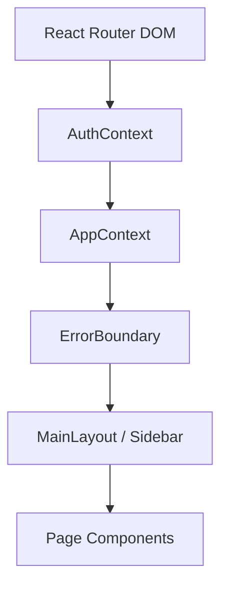
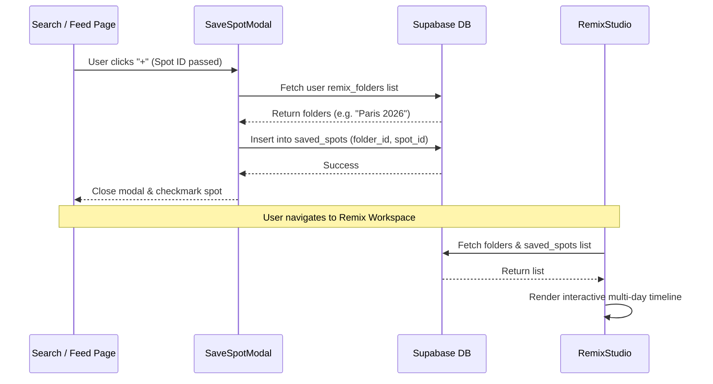

# VentureSocial Frontend Architecture Map

A structural and behavioral map of the VentureSocial client-side architecture.

---

## 1. Full Module Breakdown

The client is structured as a Single Page Application (SPA) with a provider-driven modular hierarchy:

### A. Core Providers (State Contexts)
- **`AuthContext.tsx`**: Governs Supabase token hydration, profile fetches (`profiles` table), and session caching.
- **`AppContext.tsx`**: Governs global application state, feed management, toast alerts, cart/booking arrays, custom itineraries, and follow requests.

### B. Structural Layouts & Boundaries
- **`MainLayout.tsx`**: Sidebar navigation and structural routing panels.
- **`ErrorBoundary.tsx`**: Encapsulates the provider trees and page views to intercept rendering crashes and display the fallback/recovery overlay.

### C. Components
- **`components/auth/`**: `LoginForm` & `SignupForm`.
- **`components/remix/`**: `SaveSpotModal` (saving spot cards to folders) & `TimelineComponents` (decoupled carousel & timeline wrappers).
- **`components/profile/`**: `EditProfileModal` (profile metadata manager).

---

## 2. Data Flow Between Pages

---

## 3. State Ownership (Where Data Lives)

| Data Category | State Location | Primary Hook / Variable | Lifecycle |
| :--- | :--- | :--- | :--- |
| **Authentication** | `AuthContext.tsx` | `session`, `user` | Persists via Supabase localstorage adapter. |
| **User Profile** | `AuthContext.tsx` | `userProfile` | Refetched on mount and updated via profile edits. |
| **Discover Feed** | `AppContext.tsx` | `publicPosts` | In-memory array populated from Supabase on mount. |
| **User Follows** | `AppContext.tsx` | `followedUsers`, `requestedUsers` | Loaded on mount, updated reactively on follow toggle. |
| **User Likes Cache** | `AppContext.tsx` | `userLikedPosts` | Synchronized with Supabase likes table. |
| **Offline Log Queue** | `logQueue.ts` | `queue` | In-memory batch queue synced to `localStorage`. |

---

## 4. API Dependency List

The frontend connects directly to Supabase tables and RPC functions via the client SDK:
1.  **`profiles`**: Reads and writes profile descriptors (`username`, `full_name`, `avatar_url`, `is_private`, `social_links`).
2.  **`posts`**: Fetches community-wide travel itineraries and detailed trip structures.
3.  **`trip_spots`**: Queries locations, lodging, transit, and dining details nested under itineraries.
4.  **`saved_spots` & `remix_folders`**: Stores folder designations and spot associations.
5.  **`follows` & `follow_requests`**: Records direct user associations and request approvals.

---

## 5. Risks & Broken Assumptions

-   **Zero Offline Cache Hydration**: If the connection drops and a page reload is triggered, the in-memory React states are destroyed. The app does not cache tables locally via IndexedDB.
-   **Infinite Spinner Latency**: The browser's default `fetch` socket lacks a timeout limit. If a Supabase query hangs at the gateway level, the spinner executes indefinitely unless intercepted by our custom 15-second `Promise.race` wrapper.
-   **Parallel Mutation Double-Clicks**: Certain UI buttons (such as likes or cart additions) lack optimistic locks or loading state blocks. Double clicks will trigger concurrent requests, leading to server errors or duplicate DB records.
